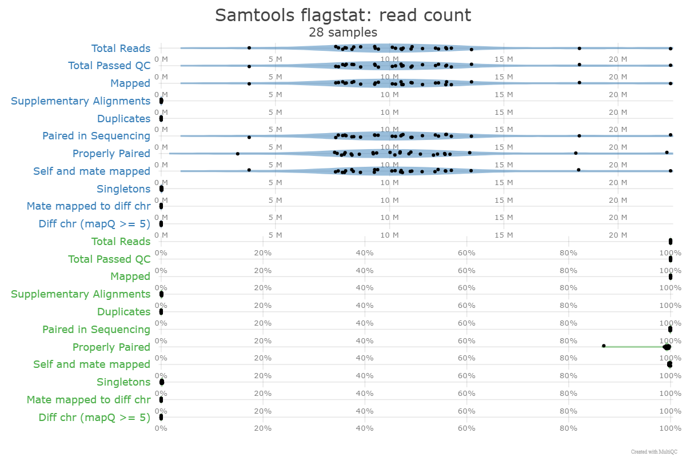

```{r setup, include=FALSE}
knitr::opts_chunk$set(echo = TRUE)
```

## Introduction
We chose the study “Experimental Evolution Reveals Unifying Systems-Level Adaptations but Diversity Driving Genotypes” to investigate for our course project. The study investigates the evolution of six strains of Escherichia Coli 
subjected to adaptive laboratory evolution (ALE). The aim of this study was to characterize genotype-fitness maps of evolution for system-level properties, including metabolic and transcriptional regulatory networks. The authors
took a multi-omic approach by studying the correlation between gene expression, gene mutation and metabolic flux. The goal was to uncover systems-level adaptations and identify consistent mutational patterns across a diverse genetic background. 

Our reanalysis will focus on processing the raw sequencing data from this study to confirm the reproducibility and robustness of the authors’ methodology. We chose this specific study due to its comprehensive coverage of core concepts in genomic data analysis, 
as well as the large amount of publicly available sequencing data. WE WILL IMPROVE AND LOOK FOR OVERSIGHTS. Our analysis will include quality control, genome indexing and paired end alignment using automated pipelines and workflows. 

Potential oversights:

No automated pipeline?
No mention of quality control?
No report of alignment stats?

## Data processing
```{r setup, include=FALSE}
knitr::opts_chunk$set(echo = False)
reference_map = {
    "SRR12170043": "NC_007779.1",
    "SRR12170044": "NC_007779.1",
    "SRR12170045": "NC_007779.1",
    "SRR12170046": "NC_007779.1",
    "SRR12170047": "NC_007779.1",
    "SRR12170048": "NC_007779.1",
    "SRR12170049": "NC_007779.1",
    "SRR12170050": "NC_000913.3",
    "SRR12170051": "NC_000913.3",
    "SRR12170052": "NC_000913.3",
    "SRR12170053": "NC_012971.2",
    "SRR12170054": "NC_000913.3",
    "SRR12170055": "NC_000913.3",
    "SRR12170056": "NC_000913.3",
    "SRR12170057": "NC_007779.1",
    "SRR12170058": "NC_000913.3",
    "SRR12170059": "NC_000913.3",
    "SRR12170060": "NC_000913.3",
    "SRR12170061": "NC_000913.3",
    "SRR12170062": "NC_000913.3",
    "SRR12170063": "NC_010468.1",
    "SRR12170064": "NC_012971.2",
    "SRR12170065": "NC_010468.1",
    "SRR12170066": "NC_010468.1",
    "SRR12170071": "NC_007779.1",
    "SRR12170072": "NC_007779.1",
    "SRR12170075": "NC_012971.2",
    "SRR12170076": "NC_012971.2"
}

rule all:
    input:
        expand("aligned/{sample}.unique.sorted.bam", sample=reference_map.keys())

rule download_sra:
    output:
        "sra/{sample}.sra"
    shell:
        "prefetch {wildcards.sample} -O sra"

rule sra_to_fastq:
    input:
        "sra/{sample}.sra"
    output:
        r1="data/{sample}_1.fastq.gz",
        r2="data/{sample}_2.fastq.gz"
    shell:
        "fastq-dump --split-files --gzip --outdir data {input}"

rule index_ref:
    input:
        "ref_genomes/{ref}.fna"
    output:
        "ref_genomes/{ref}.fna.bwt"
    shell:
        "bwa index {input}"

rule align:
    input:
        r1="data/{sample}_1.fastq.gz",
        r2="data/{sample}_2.fastq.gz",
        ref=lambda wildcards: f"ref_genomes/{reference_map[wildcards.sample]}.fna",
        idx=lambda wildcards: f"ref_genomes/{reference_map[wildcards.sample]}.fna.bwt"
    output:
        "aligned/{sample}.sam"
    shell:
        "bwa mem {input.ref} {input.r1} {input.r2} > {output}"

rule sam_to_bam:
    input:
        "aligned/{sample}.sam"
    output:
        "aligned/{sample}.bam"
    shell:
        "samtools view -bS {input} > {output}"

rule filter_unique:
    input:
        "aligned/{sample}.bam"
    output:
        "aligned/{sample}.unique.bam"
    shell:
        "samtools view -b -q 1 {input} > {output}"

rule sort_bam:
    input:
        "aligned/{sample}.unique.bam"
    output:
        "aligned/{sample}.unique.sorted.bam"
    shell:
        "samtools sort -o {output} {input}"
    
rule flagstat_qc:
    input:
        "aligned/{sample}.unique.sorted.bam"
    output:
        "qc/{sample}.flagstat.txt"
    shell:
        "samtools flagstat {input} > {output}"
    
rule count_reads:
    input:
        bam="aligned/{{sample}}.unique.sorted.bam",
        gff=lambda wildcards: f"ref_genomes/{reference_map[wildcards.sample]}.GFF"
    output:
        "counts/{sample}_counts.txt"
    shell:
        "featureCounts -a {input.gff} -o {output} {input.bam} -T 4 -p -B -C"

```

Data from the study was downloaded from the NCBI SRA database. The paired data was converted to individual fastq files. QC was then performed on the reads, and an overall summary of the QC reports as generated by MultiQC across the different samples shows promising results. 
All samples have read counts in the range of several million, from 3.9M (SRR12170052) up to 15.3M (SRR12170057). Most samples have 150 bp reads, with some having 72 bp (SRR12170056, SRR12170057) or 101 bp (SRR12170051, SRR12170052), indicating multiple sequencing runs. GC 
content ranges from 50-53%, with most libraries at 50-51%. Duplication levels vary from 25-40% for most samples, with a few showing higher duplication (SRR12170059: 83.4%/72.5%, SRR12170071/72: ~70%), while SRR12170063 showed lower duplication (22.9%/28.4%). The mean quality
 scores are high (Phred 30+) and consistent between paired samples. Per-base sequence content shows balanced nucleotide representation, with minimal 'N' bases. Adapter contamination is negligible with less than 0.1% overrepresented sequences. All FastQC modules show "green" 
 results, indicating high-quality data suitable for downstream analyses.

## Alignment 

The paper aligned all reads to their respective genome using Bowtie v1.1.2 (Langmead et al., 2009) with the following flags: -m 1 --best --strata." Bowtie is an older, ultra-fast aligner for short reads, however it is not splice aware and doesn't allow for gaps (no insertions/deletions). The flags that were used discards reads that map to more than one location and ensure the best alignment is selected. This setup appears to be chosen based on emphasizing specificity versus sensitivity. 

We chose to use BWA, which is a more modern aligner which offers better handling of mismatches and works well with longer reads. We attempted to simulate their results using this aligner by filtering out uniquely mapped reads. The raw data consisted of high-quality paired-end reads with lengths ranging from 72 bp to 150 bp, making BWA is an improved approach. Since it is optimized for read lengths in this range and supports gapped alignment and accurate handling of paired-end data—features not supported by Bowtie v1.

While Bowtie v1 offers faster performance for short, exact matches, it lacks the ability to handle insertions, deletions, and longer read lengths effectively. Given that our dataset included longer reads and that high-quality Phred scores (30+) were observed across all samples, BWA was a more appropriate choice to ensure alignment accuracy. Furthermore, by incorporating a post-alignment filtering step using samtools view -q 1, we retained only uniquely mapped reads, closely mimicking the -m 1 parameter used in the original Bowtie pipeline.

Overall, the choice to use BWA aligns with current best practices for high-quality, paired-end data and ensures robust and accurate mapping for our analyses.

#Quality Control Summary

After alignment I generated QC files for all samples and used XXX to aggregate all the data into one file for review.
After aligning all paired-end reads using BWA MEM and filtering for uniquely mapped reads, quality control was performed using samtools flagstat and summarized using MultiQC. The following key findings support the high quality of the alignment:

Mapping Rate: All samples show 100% mapping rate for uniquely aligned reads, indicating successful and specific alignment across all 28 samples.

Proper Pairing: The percentage of properly paired reads is consistently high across samples, often exceeding 98%, demonstrating that the paired-end sequencing reads are aligning as expected.

Low Duplication and Singleton Rates: Most samples have 0% duplication, and singleton rates are generally below 0.3%, suggesting minimal PCR artifacts and good library complexity.

No Cross-Chromosomal Mapping Artifacts: There were 0% reads with mates mapped to different chromosomes, showing no signs of contamination or major alignment errors.

These results confirm that the pipeline's use of BWA with unique filtering was appropriate for this dataset. It effectively retained high-confidence reads while eliminating ambiguous alignments, which is particularly important for downstream analyses like quantification and differential expression. The paper and it's data do not contain any reporting on quality control, comparison on results will have to be seen in our next analysis. 



##  Gene Quantification & Differential Expression Analysis

After generating high-quality, uniquely aligned BAM files for each sample, we quantified gene expression using featureCounts. The count_reads rule in our Snakemake pipeline was used to automate this process for all 28 samples. Each BAM file was paired with the corresponding reference genome's annotation file in GFF format, and featureCounts was used to compute gene-level read counts. The output from this step is a set of sample-specific count files (*_counts.txt), which will be used for differential expression analysis using DESeq2.

```{r}
# 1. Read in each count file (adjust file paths if needed)
df1 <- read.table("counts/NC_000913.3_counts.txt", header = TRUE, sep = "\t", skip = 1,
                  stringsAsFactors = FALSE, check.names = FALSE)
df2 <- read.table("counts/NC_007779.1_counts.txt", header = TRUE, sep = "\t", skip = 1,
                  stringsAsFactors = FALSE, check.names = FALSE)
df3 <- read.table("counts/NC_010468.1_counts.txt", header = TRUE, sep = "\t", skip = 1,
                  stringsAsFactors = FALSE, check.names = FALSE)
df4 <- read.table("counts/NC_012971.2_counts.txt", header = TRUE, sep = "\t", skip = 1,
                  stringsAsFactors = FALSE, check.names = FALSE)

# 2. Identify metadata columns and extract count columns for each data frame
meta_cols <- c("Geneid", "Chr", "Start", "End", "Strand", "Length")

# For df1
count_cols1 <- setdiff(colnames(df1), meta_cols)
df1_counts <- df1[, c("Geneid", count_cols1)]

# For df2
count_cols2 <- setdiff(colnames(df2), meta_cols)
df2_counts <- df2[, c("Geneid", count_cols2)]

# For df3
count_cols3 <- setdiff(colnames(df3), meta_cols)
df3_counts <- df3[, c("Geneid", count_cols3)]

# For df4
count_cols4 <- setdiff(colnames(df4), meta_cols)
df4_counts <- df4[, c("Geneid", count_cols4)]

# 3. Merge the data frames by "Geneid" using full outer joins (all=TRUE)
merged_df <- merge(df1_counts, df2_counts, by = "Geneid", all = TRUE)
merged_df <- merge(merged_df, df3_counts, by = "Geneid", all = TRUE)
merged_df <- merge(merged_df, df4_counts, by = "Geneid", all = TRUE)

# 4. Replace missing values (NA) with 0 (or "NULL" if you prefer a string)
merged_df[is.na(merged_df)] <- 0

# 5. Rename the SRR columns so that only the "SRR" and its number remain
#    (Assumes the first column is "Geneid" which we want to leave unchanged)
new_names <- colnames(merged_df)
new_names[-1] <- sub(".*(SRR\\d+).*", "\\1", new_names[-1])
colnames(merged_df) <- new_names

# 6. Convert the resulting data frame to a matrix if needed
final_matrix <- as.matrix(merged_df)

write.table(final_matrix, file = "final_matrix.txt", sep = "\t", row.names = FALSE, quote = FALSE)


```


## Differential Expression Analysis
```{r}
# Load libraries
library(DESeq2)
library(ggplot2)
library(pheatmap)
library(ggrepel)
library(BiocParallel)

# 1. Load count data (gene IDs in first column)
count_data <- read.table("final_matrix.txt",
                         header = TRUE,
                         sep = "\t",
                         row.names = 1,
                         stringsAsFactors = FALSE)

# 2. Load sample metadata (SampleID must be row names)
sample_info <- read.csv("Col_Metadata.csv",
                        header = TRUE,
                        row.names = 1,
                        stringsAsFactors = TRUE)

# 3. Match samples
if (!all(colnames(count_data) %in% rownames(sample_info))) {
  stop("Mismatch between count_data columns and sample_info row names!")
}
sample_info <- sample_info[colnames(count_data), , drop = FALSE]

# 4. Build DESeqDataSet (design uses your metadata column ‘condition’)
dds <- DESeqDataSetFromMatrix(countData = count_data,
                              colData   = sample_info,
                              design    = ~ condition)

# 5. Filter out genes with zero total counts
dds <- dds[rowSums(counts(dds)) > 0, ]

# 6. Remove samples with zero total counts (if any)
libs <- colSums(counts(dds))
zero_samps <- names(libs[libs == 0])
if (length(zero_samps)) {
  message("Removing samples with zero counts: ", paste(zero_samps, collapse = ", "))
  dds <- dds[, libs > 0]
}

# 7. (Optional) Filter genes expressed in fewer than 2 samples
keep_genes <- rowSums(counts(dds) > 0) >= 2
dds <- dds[keep_genes, ]

# 8. Inspect levels and result names
message("Condition levels: ", paste(levels(dds$condition), collapse = ", "))
message("Results names: ", paste(resultsNames(dds), collapse = ", "))

# 9. Run DESeq with poscounts size‑factor estimation in parallel
register(MulticoreParam(11))
dds <- DESeq(dds, sfType = "poscounts", parallel = TRUE)

# 10. Extract results by name (as shown in resultsNames)
#     Here DESeq2 gave "condition_Wild_vs_Evolved"
res <- results(dds, name = "condition_Wild_vs_Evolved")
res_df <- as.data.frame(res)
res_df$gene <- rownames(res_df)
# 11. Filter for significant DEGs
sig_res <- subset(res_df, padj < 0.05)
```

```{r}
# 12. Prepare data for volcano plot
#    Handle zero/NA padj, compute –log10(padj), and flag significance
res_df$padj[is.na(res_df$padj)] <- 1
min_nonzero <- min(res_df$padj[res_df$padj > 0])
res_df$padj[res_df$padj == 0] <- min_nonzero
res_df$negLog10Padj <- -log10(res_df$padj)
res_df$significant  <- with(res_df, padj < 0.05 & abs(log2FoldChange) >= 1)

# 13. Select top 10 genes by smallest padj for labeling
topLabels <- res_df[order(res_df$padj), ][1:10, ]

# 14. Build the volcano plot
p_volcano <- ggplot(res_df, aes(x = log2FoldChange, y = negLog10Padj)) +
  geom_point(aes(color = significant), alpha = 0.6, size = 1.5) +
  scale_color_manual(values = c("grey70", "red")) +
  geom_hline(yintercept = -log10(0.05), linetype = "dashed", color = "blue") +
  geom_vline(xintercept = c(-1, 1),      linetype = "dashed", color = "blue") +
  geom_text_repel(data = topLabels,
                  aes(label = gene),
                  size = 3, max.overlaps = 10) +
  theme_minimal(base_size = 14) +
  labs(title = "Volcano Plot of Differential Expression",
       x     = "Log2 Fold Change",
       y     = "-Log10 Adjusted P-value") +
  theme(legend.position = "none")

# 15. Save the volcano plot to a PNG file
png("volcano_plot.png", width = 8, height = 6, units = "in", res = 300)
print(p_volcano)
dev.off()

# 16. Also display in the R session
print(p_volcano)

# 17. Heatmap of top 20 DE genes (normalized counts)
top20 <- head(order(res$padj), 20)
mat20 <- counts(dds, normalized = TRUE)[top20, ]

# 18. Prepare annotation and transliterate to ASCII
annot <- sample_info[colnames(mat20), , drop = FALSE]
rownames(annot) <- iconv(rownames(annot), from = "", to = "ASCII//TRANSLIT")
annot[]         <- lapply(annot, function(x) iconv(as.character(x), from = "", to = "ASCII//TRANSLIT"))
rownames(mat20) <- iconv(rownames(mat20), from = "", to = "ASCII//TRANSLIT")

# 19. Plot heatmap
pheatmap(mat20,
         scale          = "row",
         annotation_col = annot,
         main           = "Heatmap of Top 20 DE Genes",
         show_rownames  = TRUE,
         show_colnames  = TRUE)

# 20. Save the full results table
write.table(res_df,
            file      = "differential_expression_results.txt",
            sep       = "\t",
            quote     = FALSE,
            row.names = TRUE)

```

```{r}
library(tidyverse)

file <- "msystems.00165-22-s0007.csv"

# 1. Read the first two lines to get sample identifiers
header1 <- readLines(file, n = 1)
header2 <- readLines(file, n = 2)[2]

# Drop the first two empty fields, leaving one entry per sample
h1 <- strsplit(header1, ",")[[1]][-c(1,2)]
h2 <- strsplit(header2, ",")[[1]][-c(1,2)]

# Best-fit flux columns occur every 4th column, so pick indices 1,5,9,...
bf_idx2 <- seq(1, length(h1), by = 4)

# Build sample IDs as Strain_Stage
sample_ids <- paste0(h1[bf_idx2], "_", h2[bf_idx2])

# 2. Read the “RELATIVE FLUXES” section, skipping lines 1–8 so line 9 is the header
flux_raw <- read.csv(file,
                     skip            = 8,
                     header          = TRUE,
                     check.names     = FALSE,
                     stringsAsFactors = FALSE)

# 3. Extract reaction names (from the "Flux" column) and the best-fit flux columns
reaction_names <- flux_raw$Flux
bf_indices     <- seq(3, ncol(flux_raw), by = 4)
flux_best      <- flux_raw[, bf_indices]

# 4. Assign the parsed sample IDs
if (length(sample_ids) != ncol(flux_best)) {
  stop("Parsed sample_ids length does not match number of best-fit columns!")
}
colnames(flux_best) <- sample_ids

# 5. Build a wide data frame and pivot to long format
flux_long <- data.frame(reaction = reaction_names, flux_best, stringsAsFactors = FALSE) %>%
  pivot_longer(-reaction, names_to = "SampleID", values_to = "flux") %>%
  mutate(
    flux    = as.numeric(flux),                           # convert to numeric
    Strain  = sub("_.*$", "", SampleID),                  # text before first underscore
    Stage   = if_else(grepl("_WT$", SampleID), "WT", "EP") # WT vs EP
  )

# 6. Inspect the reshaped data
glimpse(flux_long)
```

